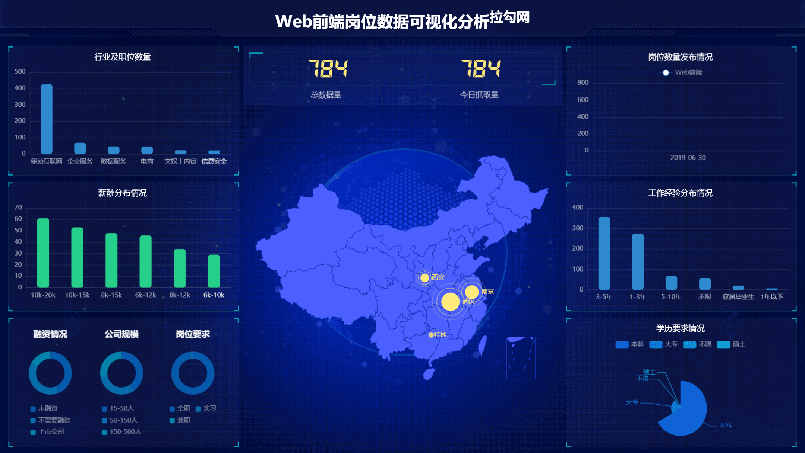

# Python可视化

1. 抓取全国python岗位信息
2. 设计数据存储结构
3. 将抓取到的数据保存到mysql数据库中
4. 使用echarts绘制图表

## 截图

## 使用

> 可以把Web前端换成其他工作招聘

1. 使用virtualenv创建一个python环境
2. pip install -r requirements.txt
3. python lagou/handle_crawl.py 来爬取数据存入mysql数据库
4. node server/index.js 把mysql数据转成json文件
5. 复制tmp到datav/static下
6. datav下面npm i && npm start

---

## 操作频繁

1. referer url头部
2. 代理IP使用

## 前端 Vue
1. vue组件嵌iframe会导致一直刷新